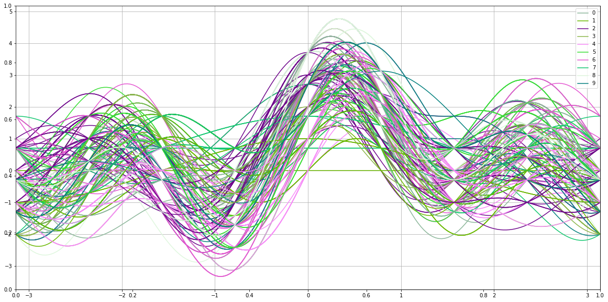
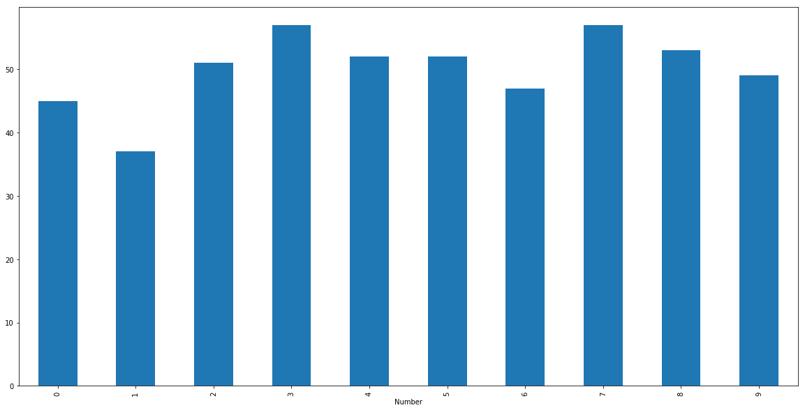

LED Display Domain data set

Description.

This simple domain contains 7 Boolean attributes, one for each light-emitting diode of a 7-segment display. The task is to determine which digit is been shown in the display. The problem would be easy if not for the introduction of noise. In this case, each attribute value has the 10% probability of having its value inverted.  

@attribute Led1 integer [0, 1]  
@attribute Led2 integer [0, 1]  
@attribute Led3 integer [0, 1]  
@attribute Led4 integer [0, 1]  
@attribute Led5 integer [0, 1]  
@attribute Led6 integer [0, 1]  
@attribute Led7 integer [0, 1]  
@attribute Number {0,1,2,3,4,5,6,7,8,9}  
@inputs Led1, Led2, Led3, Led4, Led5, Led6, Led7  
@outputs Number  

The following experiment makes use of sklearn.ensemble RandomForestClassifier.


```python
from Helper.Load.classification import Classification
from Helper.Visual.classification import VClassification
from Helper.Transform.Transform.classification import Classificaton_Transform
from Helper.Train.Train import Train

from sklearn.ensemble import RandomForestClassifier
import numpy as np
import matplotlib.pyplot as plt
import pandas as pd
```


```python
loadC = Classification("Data", "led7digit.dat", "led7digit-names.txt")
# from Experiment.experiment1.columns import Column_pipeline_Dictionary
from Data.columns import Column_pipeline_Dictionary # Note: In master Helper directory, we made changes to Base_transform 
                                                    # s.t. it accepts a dictionary of pipelines which dictate the transforms
                                                    # to each column. We also will have a dictionary which transforms inputs at
                                                    # at a global level. Base Transform should also have an attribute which shows
                                                    # the possible hyperparameters that can be adjusted in our cross validation.
transformC = Classificaton_Transform(loadC)
# from Experiment.experiment1.hyperparameters import hyperparameters
from Data.hyperparameters import hyperparameters
trainC = Train(loadC, Classificaton_Transform, RandomForestClassifier)
```


Andrew Curve displaying raw data.




```python
#loadC.data.head()
transformC.data.head()
```


<div>
<style scoped>
    .dataframe tbody tr th:only-of-type {
        vertical-align: middle;
    }

    .dataframe tbody tr th {
        vertical-align: top;
    }

    .dataframe thead th {
        text-align: right;
    }
</style>
<table border="1" class="dataframe">
  <thead>
    <tr style="text-align: right;">
      <th></th>
      <th>Led1</th>
      <th>Led2</th>
      <th>Led3</th>
      <th>Led4</th>
      <th>Led5</th>
      <th>Led6</th>
      <th>Led7</th>
      <th>Number</th>
    </tr>
  </thead>
  <tbody>
    <tr>
      <th>0</th>
      <td>1</td>
      <td>0</td>
      <td>1</td>
      <td>1</td>
      <td>0</td>
      <td>1</td>
      <td>1</td>
      <td>3</td>
    </tr>
    <tr>
      <th>1</th>
      <td>1</td>
      <td>1</td>
      <td>1</td>
      <td>0</td>
      <td>0</td>
      <td>1</td>
      <td>0</td>
      <td>4</td>
    </tr>
    <tr>
      <th>2</th>
      <td>0</td>
      <td>1</td>
      <td>1</td>
      <td>1</td>
      <td>1</td>
      <td>1</td>
      <td>1</td>
      <td>8</td>
    </tr>
    <tr>
      <th>3</th>
      <td>1</td>
      <td>0</td>
      <td>1</td>
      <td>0</td>
      <td>0</td>
      <td>1</td>
      <td>0</td>
      <td>7</td>
    </tr>
    <tr>
      <th>4</th>
      <td>1</td>
      <td>1</td>
      <td>1</td>
      <td>0</td>
      <td>1</td>
      <td>1</td>
      <td>1</td>
      <td>0</td>
    </tr>
  </tbody>
</table>
</div>


```python
pipe = trainC.pipeline
```


```python
pipe.get_params().keys()
```


    dict_keys(['memory', 'steps', 'inputs_pipeline', 'estimator', 'inputs_pipeline__memory', 'inputs_pipeline__steps', 'inputs_pipeline__inputs', 'inputs_pipeline__inputs__n_jobs', 'inputs_pipeline__inputs__transformer_list', 'inputs_pipeline__inputs__transformer_weights', 'inputs_pipeline__inputs__Led1', 'inputs_pipeline__inputs__Led2', 'inputs_pipeline__inputs__Led3', 'inputs_pipeline__inputs__Led4', 'inputs_pipeline__inputs__Led5', 'inputs_pipeline__inputs__Led6', 'inputs_pipeline__inputs__Led7', 'inputs_pipeline__inputs__Led1__memory', 'inputs_pipeline__inputs__Led1__steps', 'inputs_pipeline__inputs__Led1__Led1_selector', 'inputs_pipeline__inputs__Led1___LabelBinarizer_transform', 'inputs_pipeline__inputs__Led1__Led1_selector__key', 'inputs_pipeline__inputs__Led2__memory', 'inputs_pipeline__inputs__Led2__steps', 'inputs_pipeline__inputs__Led2__Led2_selector', 'inputs_pipeline__inputs__Led2___LabelBinarizer_transform', 'inputs_pipeline__inputs__Led2__Led2_selector__key', 'inputs_pipeline__inputs__Led3__memory', 'inputs_pipeline__inputs__Led3__steps', 'inputs_pipeline__inputs__Led3__Led3_selector', 'inputs_pipeline__inputs__Led3___LabelBinarizer_transform', 'inputs_pipeline__inputs__Led3__Led3_selector__key', 'inputs_pipeline__inputs__Led4__memory', 'inputs_pipeline__inputs__Led4__steps', 'inputs_pipeline__inputs__Led4__Led4_selector', 'inputs_pipeline__inputs__Led4___LabelBinarizer_transform', 'inputs_pipeline__inputs__Led4__Led4_selector__key', 'inputs_pipeline__inputs__Led5__memory', 'inputs_pipeline__inputs__Led5__steps', 'inputs_pipeline__inputs__Led5__Led5_selector', 'inputs_pipeline__inputs__Led5___LabelBinarizer_transform', 'inputs_pipeline__inputs__Led5__Led5_selector__key', 'inputs_pipeline__inputs__Led6__memory', 'inputs_pipeline__inputs__Led6__steps', 'inputs_pipeline__inputs__Led6__Led6_selector', 'inputs_pipeline__inputs__Led6___LabelBinarizer_transform', 'inputs_pipeline__inputs__Led6__Led6_selector__key', 'inputs_pipeline__inputs__Led7__memory', 'inputs_pipeline__inputs__Led7__steps', 'inputs_pipeline__inputs__Led7__Led7_selector', 'inputs_pipeline__inputs__Led7___LabelBinarizer_transform', 'inputs_pipeline__inputs__Led7__Led7_selector__key', 'estimator__bootstrap', 'estimator__class_weight', 'estimator__criterion', 'estimator__max_depth', 'estimator__max_features', 'estimator__max_leaf_nodes', 'estimator__min_impurity_decrease', 'estimator__min_impurity_split', 'estimator__min_samples_leaf', 'estimator__min_samples_split', 'estimator__min_weight_fraction_leaf', 'estimator__n_estimators', 'estimator__n_jobs', 'estimator__oob_score', 'estimator__random_state', 'estimator__verbose', 'estimator__warm_start'])


```python
hyperparameters
```


    {'estimator__max_depth': [1, 2, 4, 8, 10],
     'estimator__n_estimators': [100, 110, 120, 200, 250, 300],
     'estimator__class_weight': ['balanced']}


```python
clf = trainC.fit_GSCV(hyperparameters)
```

    /anaconda3/lib/python3.6/site-packages/sklearn/model_selection/_search.py:841: DeprecationWarning: The default of the `iid` parameter will change from True to False in version 0.22 and will be removed in 0.24. This will change numeric results when test-set sizes are unequal.
      DeprecationWarning)


```python
clf.best_params_
```


    {'estimator__class_weight': 'balanced',
     'estimator__max_depth': 4,
     'estimator__n_estimators': 120}


```python
clf.refit
```


    True


```python
preds = clf.predict(loadC.partition.X_test)
probs = clf.predict_proba(loadC.partition.X_test)
np.mean(preds == loadC.partition.y_test.values.ravel())
```


    0.7393939393939394


```python
from sklearn.metrics import confusion_matrix, classification_report
confusion_matrix(loadC.partition.y_test.values, preds)
```


    array([[10,  1,  0,  0,  0,  0,  1,  0,  1,  2],
           [ 0,  9,  0,  1,  0,  0,  0,  2,  0,  0],
           [ 0,  0, 13,  3,  0,  0,  1,  0,  0,  0],
           [ 0,  0,  0, 15,  1,  1,  0,  0,  0,  2],
           [ 0,  0,  0,  0, 14,  1,  0,  0,  0,  2],
           [ 0,  0,  0,  0,  0, 16,  1,  0,  0,  0],
           [ 0,  0,  0,  0,  0,  1, 13,  0,  2,  0],
           [ 1,  2,  2,  0,  0,  1,  0, 13,  0,  0],
           [ 1,  0,  3,  1,  0,  1,  2,  0,  8,  1],
           [ 0,  0,  2,  0,  0,  0,  0,  0,  3, 11]])


```python
print(classification_report(loadC.partition.y_test.values, preds))
```

                  precision    recall  f1-score   support
    
               0       0.83      0.67      0.74        15
               1       0.75      0.75      0.75        12
               2       0.65      0.76      0.70        17
               3       0.75      0.79      0.77        19
               4       0.93      0.82      0.87        17
               5       0.76      0.94      0.84        17
               6       0.72      0.81      0.76        16
               7       0.87      0.68      0.76        19
               8       0.57      0.47      0.52        17
               9       0.61      0.69      0.65        16
    
       micro avg       0.74      0.74      0.74       165
       macro avg       0.74      0.74      0.74       165
    weighted avg       0.75      0.74      0.74       165
    

