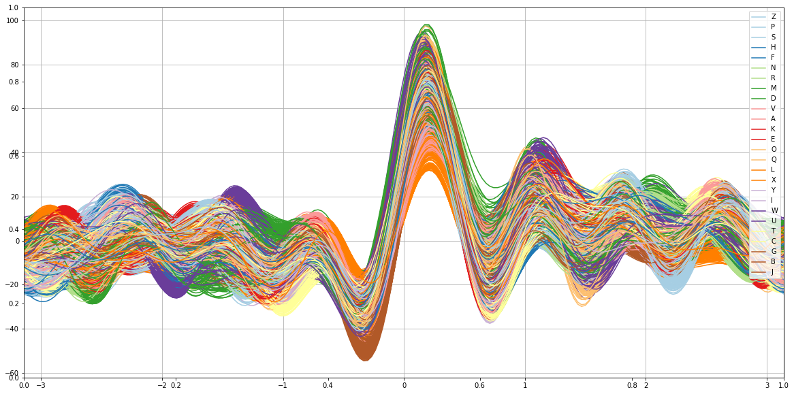
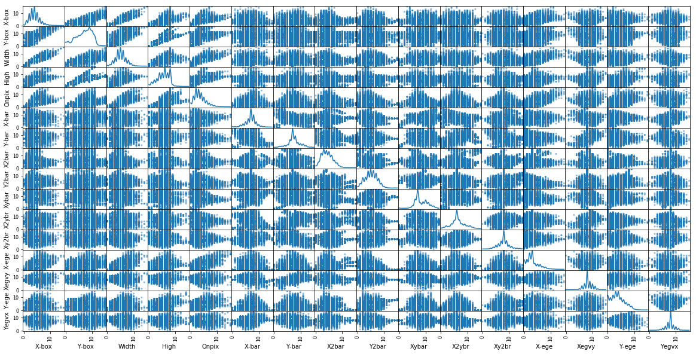

# letters
1: Description.

The objective is to identify each of a large number of black-and-white rectangular pixel displays as one of the 26 capital letters in the English alphabet. The character images were based on 20 different fonts and each letter within these 20 fonts was randomly distorted to produce a file of 20,000 unique stimuli. Each stimulus was converted into 16 primitive numerical attributes (statistical moments and edge counts) which were then scaled to fit into a range of integer values from 0 through 15.

# Experiments
[RandomForest](Experiments/RandomForest_/)  
[GaussianNB](Experiments/GaussianNB/)  
[GaussianProcessClassifier](Experiments/GaussianProcessClassifier/)  
[RandomForestClassifier](Experiments/RandomForestClassifier/)  
[AdaBoostRFC](Experiments/AdaBoost(RandomForestClassifier)/)  

2: Type.			Classification	  
3: Origin.			Real World  
4: Instances.		20000  
5: Features.		16  
6: Classes.			26	  
7: Missing values.	No  

# Raw Data

