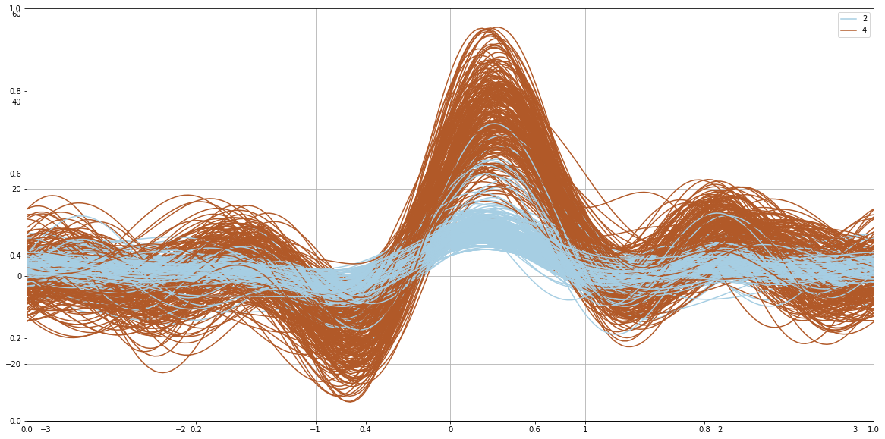

# MachineLearning

## Supervised Learning Projects
### KEEL
1. [led7digit](KEEL/Projects/Supervised/Standard/led7digit/)  
   LED Display Domain data set  
   This simple domain contains 7 Boolean attributes, one for each light-emitting diode of a 7-segment display. The task is to determine which digit is been shown in the display. The problem would be easy if not for the introduction of noise. In this case, each attribute value has the 10% probability of having its value inverted.  
2. [Bananna](KEEL/Projects/Supervised/Standard/Bananna/)  
3. [Haberman](KEEL/Projects/Supervised/Standard/Haberman/)  
4. [Abaone](KEEL/Projects/Supervised/Standard/Abalone/)  
5. [wisconsin](KEEL/Projects/Supervised/Standard/wisconsin/)  
   Breast Cancer Wisconsin (Original) data set  
   This dataset contains cases from a study that was conducted at the University of Wisconsin Hospitals, Madison, about patients who had undergone surgery for breast cancer. The task is to determine if the detected tumor is benign (2) os malignant (4).  
6. [iris](KEEL/Projects/Supervised/Standard/iris/)  
  Iris plants dataset  
  This is perhaps the best known database to be found in the pattern recognition literature. The data set contains 3 classes of 50 instances each, where each class refers to a type of iris plant. One class is linearly separable from the other 2; the latter are NOT linearly separable from each other.  
7. [letters](KEEL/Projects/Supervised/letters/)
  Letter Recognition data set  
  The objective is to identify each of a large number of black-and-white rectangular pixel displays as one of the 26 capital letters in the English alphabet. The character images were based on 20 different fonts and each letter within these 20 fonts was randomly distorted to produce a file of 20,000 unique stimuli. Each stimulus was converted into 16 primitive numerical attributes (statistical moments and edge counts) which were then scaled to fit into a range of integer values from 0 through 15.  

